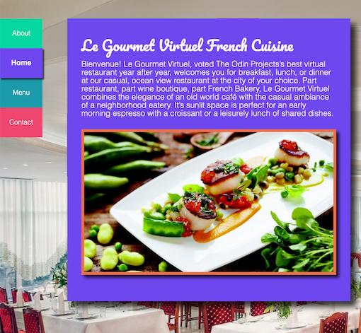
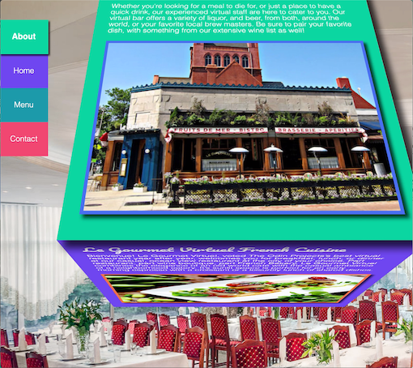

## Project: Restaurant Page - React JS Version
A demo page created with React and featuring a rotating 3D cube for page transitions.
This is a remake of the [original no-framework version](https://github.com/winplam/restaurant-page) but with refactoring DOM elements to use the React JS framework. 

### [View in Browser](https://winplam.github.io/restaurant-react-version/)

The goal of this project is to use JavaScript DOM manipulation to generate web page entirely from JavaScript code.
The index.html contains almost nothing inside the body tag except for an empty DIV tag JavaScript uses as a container to hook onto.
The methods for generating the HTML is stored in the rendPage.js file and the parameters for supplying the data attributes were stored in index.js.
Webpak dev server was used to compile to source code into a main.js file in the dist folder.

The funniest part of this exercise was making a 3D rotating cube to transition better the different pages.
Essentially this cube was originally designed to be a rotating menu with only 3 sides.
I've made the face significantly larger and added a 4th side to complete a cube. CSS transfer and rotation tags were used to perform the 3D animation making it smooth and seamless.

## Screenshots

## 3D Rotation

## Technologies Used
This page was created with React JS framework, HTML 5, CSS3 and the help of Wedpak to bundle the code into a single file.
